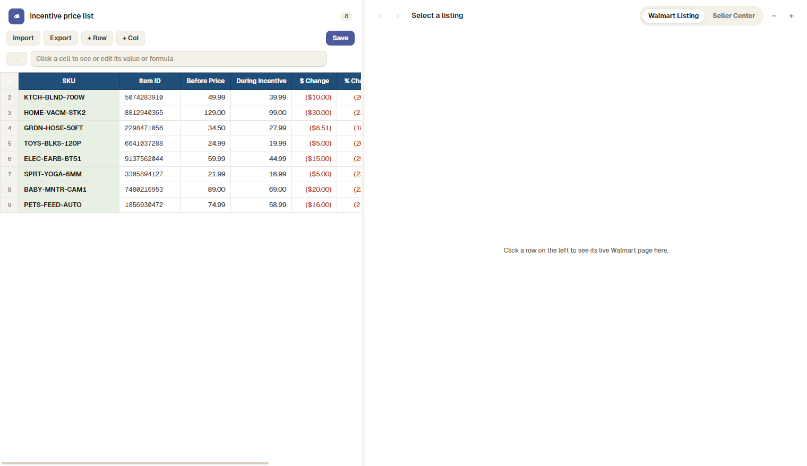

<div align="center">
  
  <h1>Walmart Listing Browser</h1>
  <p><b>Spreadsheet-style incentive price list with live Walmart listing browsing.</b></p>
  <p><a href="../../releases/latest"><b>⬇ Download the Windows installer</b></a></p>
</div>



Keep an incentive price sheet on the left, and click any row to see its **live walmart.com listing** docked on the right — no tab-juggling between a spreadsheet and a browser.

## Features

- **Spreadsheet UI** — editable cells, formula bar, formulas (`=D2-C2`), Ctrl+F find, sortable columns, drag-to-reorder rows, custom columns.
- **Live listing pane** — the real walmart.com product page for the selected row, docked beside the sheet, with zoom and prev/next navigation.
- **Walmart Listing ⇄ Seller Center toggle** — flip the pane between the customer-facing listing and a free-browsing Seller Center session (sign in once; loads once; row clicks never disturb it).
- **Row auto-jump** — browse to another listing or variant inside the pane and the sheet selects that row automatically.
- **Import** — pull rows in from `.xlsx` / `.csv` / `.tsv`, or paste straight from Google Sheets with Ctrl+V; optional per-row commission columns are picked up by header name.
- **Export** — the regular sheet (live formulas), or the 11-column incentive template the Walmart rep uploads, prefilled with partner details and per-row commission rates.
- **Auto-computed columns** — `$ Change` and `% Change` recompute from Before / During prices.
- **Local-first** — everything is stored in a local JSON file; no accounts, no server.

## Getting started

```bash
npm install
npm start
```

### Build the Windows installer

```bash
npm run dist
```

The branded NSIS installer lands in `dist/Walmart Listing Browser Setup <version>.exe`.

### Build the macOS app

Run this **on a Mac** (a `.dmg` can only be built on macOS):

```bash
npm install
npm run dist:mac
```

The disk image lands in `dist/Walmart Listing Browser-<version>.dmg`. Open it and
drag the app into **Applications** — from then on it's a normal double-click app.
It isn't code-signed, so the first launch shows an "unidentified developer"
warning: right-click the app → **Open** → **Open**, and macOS remembers it.

## Import format

The first four columns of your sheet, in this order (a header row is fine — it's skipped):

| A | B | C | D |
|---|---|---|---|
| SKU | Item ID | Before Price | During Incentive |

Only SKU and Item ID are required; extra columns (`$ Change`, `% Change`, …) are ignored on import and recomputed in-app.

Optionally add `Regular Commission` and `During Incentive Commission` columns (any position — they're matched by header name). Rows without them default to 6% / 2%; the values fill the commission rates in the "For Walmart rep" export.

## Tech notes

- Electron 33, plain HTML/CSS/JS renderer (no framework).
- The listing pane is a `WebContentsView` — walmart.com refuses to render into a `<webview>`, so a window-grade view is docked over the layout instead.
- `exceljs` powers `.xlsx` import/export.
- Icon assets live in [`build/`](build/) — `icon.svg` is the master; `icon.png` / `icon.ico` are rasterized from it.

---

<div align="center"><sub>© 2026 Imran Tursun · Internal tool — not affiliated with or endorsed by Walmart Inc.</sub></div>
